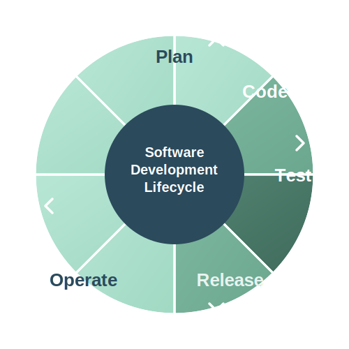

# Managing Modernization at Scale: A Vision for Firm-Wide Technical Debt Management

## Executive Summary

Over the past two years, we have proven that technical debt can be measured and managed at scale. Our Technology Modernization fleet has helped developers modernize over 1,500 applications, delivering measurable business outcomes: delivery lead times reduced by 20%, and change failure rates cut in half across the board.

We started this journey with 11 key measurements. Now, we're ready to expand our impact.

This document outlines our vision and plan to measure and manage technical debt in all its forms across the firm. By meeting developers where they are in the Software Development Lifecycle (SDLC)—from planning through operations—we will make modernization journeys frictionless, actionable, and aligned with business value.

**Our approach is built on three pillars:**

- **Modern Architecture** - Well-designed systems that scale and adapt
- **Modern Technology** - Current platforms, languages, and tools
- **Modern Practices** - Efficient workflows and engineering excellence

This is not just about technology. It's about enabling agility, reducing risk, and lowering costs across the entire firm. And it's about building the capabilities—backed by TechMod—to sustain modernization at scale for years to come.

## The Cost of Technical Debt

Technical debt is not just a technical problem—it's a business problem. It directly impacts our ability to deliver on three core technology values, each measured by specific KPIs:

**1. Enable Growth & Efficiency**

Technical debt slows us down. Legacy systems, outdated technologies, and poorly documented architectures increase development lead times and delay time to deployment readiness. Every day spent navigating technical debt is a day not spent delivering customer value.

**KPIs:**

- **Development Lead Time** - Time from commit to production deployment
- **Time to Deployment Readiness** - Time from feature request to deployment-ready state

**2. Strengthen Resilience**

Technical debt increases risk. High change failure rates, security vulnerabilities in aging dependencies, and brittle systems that break under change all stem from accumulated technical debt. Resilient systems require modern foundations.

**KPIs:**

- **Change Failure Rate** - Percentage of deployments causing production incidents
- **Hygiene Activities** - Effort spent on maintenance, bug fixes, and technical debt remediation

**3. Improve Effectiveness**

Technical debt drains engineering capacity. When developers spend time working around limitations rather than building new capabilities, we reduce pull requests per developer and increase the cost of maintaining our technology infrastructure.

**KPIs:**

- **Pull Requests per Developer** - Developer productivity and contribution rate
- **Infrastructure IP&C Spend** - Infrastructure investment, provisioning, and consumption costs

### The Opportunity

The good news? We can measure these impacts—and we can improve them.

One example: A super department supporting our Investment Banking & Global Capital Markets business reduced their overall lead times by **25%**—from over 1 month per feature to just over 3 weeks—while keeping headcount flat. They achieved this by reducing the number of applications they manage and cutting dependencies on legacy and high-risk technologies.

**This is the opportunity modernization unlocks:** improved agility, reduced risk, and lower investment costs—all achievable with modest effort when approached systematically.

## Our Mission

Our mission is to **measure and help the firm manage technical debt in all its forms**.

We do this through **TechMod**—our Strategic Product Management platform that provides centralized tracking, measurement, and governance of modernization efforts across the firm.

### From 11 Measurements to Comprehensive Coverage

We started with 11 key measurements that gave us visibility into critical aspects of technical debt. These measurements proved their value: they guided over 1,500 application modernizations and delivered measurable improvements in lead times, stability, and delivery performance.

Now, we're expanding our scope to cover technical debt across **three pillars of modernization**:

**Modern Architecture**

- Well-designed systems that scale and adapt
- Clear separation of concerns and bounded contexts
- Architectural patterns that enable agility and maintainability

**Modern Technology**

- Current platforms, languages, and frameworks
- Elimination of deprecated and high-risk dependencies
- Technology choices aligned with firm standards and industry best practices

**Modern Practices**

- Efficient workflows and engineering excellence
- Automated testing, deployment, and operations
- Documentation, collaboration, and knowledge sharing

By measuring technical debt across all three pillars, we can provide a complete picture of modernization health and guide teams toward sustainable improvement.

## Guiding Principles

Our approach to measuring and managing technical debt is grounded in principles that ensure our work delivers real value to developers and the firm:

### 1. Value-Driven Measurement

Every measurement must tie back to our technology value drivers: Enable Growth & Efficiency, Strengthen Resilience, and Improve Effectiveness. We don't measure for measurement's sake—we measure what matters to business outcomes.

### 2. Accuracy and Reliability

Our measurements must be objective, consistent, and trustworthy. Developers need to trust the data to take action on it. We prioritize automated, tool-based measurements over subjective assessments wherever possible.

### 3. Actionable Scores

Scores and metrics are only valuable if developers can act on them. Every measurement must come with clear guidance: what does this score mean? What should I do about it? How do I improve it?

### 4. Meet Developers Where They Are

We integrate modernization guidance directly into the Software Development Lifecycle (SDLC)—from planning through operations. Whether a developer is drafting a requirement in Jira, authoring an ADR, writing code in their IDE, or reviewing a deployment pipeline, our tooling meets them in their workflow with relevant, timely guidance.

### 5. Make the Right Choice, the Easy Choice

Our modernization "recipes"—the patterns, tools, and workflows we provide—must be as efficient as possible. We reduce friction, automate where we can, and provide clear, repeatable paths to improvement. Developer time is precious; we respect it by making modernization journeys as smooth as possible.

### 6. Common Solutions for Common Problems

We promote re-use and convergence on proven patterns. When applications solve the same problem in different ways, we measure that divergence and guide teams toward shared solutions. This reduces duplication, lowers maintenance burden, and leverages tried-and-tested approaches rather than continuously rediscovering what doesn't work.

## Prioritization Framework

With potentially 50-100 different forms of technical debt we could measure and manage, we need a clear framework for deciding where to focus our efforts. Not all technical debt is created equal, and not all of it is worth tackling immediately.

We prioritize technical debt based on three critical criteria:

### 1. Value Alignment

**Can we tie this technical debt to one or more of our technology value drivers?**

Technical debt that clearly impacts Growth & Efficiency, Resilience, or Effectiveness takes priority. Interesting metrics that don't connect to business outcomes are lower priority—we don't measure for measurement's sake.

### 2. Measurement Accuracy

**Can we measure this technical debt accurately and reliably?**

We need objective, consistent measurements that developers trust. Technical debt that requires subjective assessment or manual data collection is harder to scale and less reliable. We prioritize areas where we can automate measurement and provide consistent, trustworthy data.

### 3. Manageability

**Can developers effectively manage and reduce this technical debt?**

Even if we can measure something accurately, if the journey to fix it is arduous, difficult, or unpalatable for developers, adoption will be low and impact will be limited. We prioritize technical debt where we can provide efficient recipes, clear guidance, and practical paths to improvement.

### Our Priority Quadrants

Based on these criteria, technical debt falls into four quadrants:

**Quadrant 1: Low Priority**

- Cannot tie to value drivers
- Interesting but unclear business impact
- Deprioritize until value connection is established

**Quadrant 2: Future Opportunity**

- Clear value driver
- Difficult to measure accurately and reliably
- Invest in measurement capabilities before rolling out

**Quadrant 3: Needs Enablement**

- Clear value driver
- Can measure accurately
- No effective management path (arduous, difficult journey)
- Build recipes and tooling before broad rollout

**Quadrant 4: Active Focus** ⭐

- Clear value driver
- Can measure accurately and reliably
- Can be managed effectively with reasonable effort
- **This is where we focus first**

Our current measurements (listed in each pillar above) are all in Quadrant 4. Our future measurements represent our pipeline—investments we're making to move items from Quadrants 2 and 3 into Quadrant 4.

### Governance

[To be written: Decision-making process for backlog prioritization and sign-off]

## Architectural Implications

These guiding principles have direct architectural implications for how we build TechMod and our broader modernization platform. This section maps each principle to the implications that will aid us in identifying concrete capabilities and system design decisions required to support them.

| Principle                                     | Architectural Implication           | Description                                                                                                                                                                                              |
| --------------------------------------------- | ----------------------------------- | -------------------------------------------------------------------------------------------------------------------------------------------------------------------------------------------------------- |
| **1. Value-Driven Measurement**               | Explicit Value Mapping Requirement  | Every measurement in TechMod must have an explicit mapping to at least one of the three value drivers (Growth & Efficiency, Resilience, Effectiveness) - if it can't be mapped, it shouldn't be measured |
|                                               | Value-Driven Data Model             | The data model must support tracking which value driver(s) each measurement connects to, enabling filtering and reporting by business value                                                              |
|                                               | KPI Measurement and Reporting       | We must be able to measure the value delivered, record these KPIs over time, and report on progress against the value drivers                                                                            |
| **2. Accuracy & Reliability**                 | Deterministic Technology Detection  | We must be able to deterministically confirm what technology an application is using (no guesswork or subjective classification)                                                                         |
|                                               | Traceable Technology Changes        | Changes in what an application is using must be traceable over time (audit trail, version history)                                                                                                       |
|                                               | Common Technology Detection Service | We must use the same common service for determining what technology an application is using (prevents inconsistent detection across tools)                                                               |
|                                               | Common Scoring Service              | We must use the same common service for determining how we're scoring an application (prevents ADR tool recommending one thing while scoring system measures another)                                    |
| **3. Actionable Scores**                      | Meaningful Action Availability      | We can only score on opportunities where the application developer can meaningfully take action (e.g., don't flag old OS version if newer version isn't available to them)                               |
|                                               | Minimum Documentation Requirement   | Every scored item must have, at minimum, documentation on how to address it (we cannot score developers down for not knowing how to fix something we haven't documented)                                 |
| **4. Meet Developers Where They Are**         | SDLC Integration at Every Stage     | Modernization options must be available to developers at every step of the SDLC lifecycle (integrated into Jira and ADR process during planning, IDE during coding, CI/CD pipelines during release)      |
|                                               | Start from Current State            | Modernization journeys must start from where applications already are (no point discussing Python upgrades if teams are running Perl - meet them at their current technology stack)                      |
| **5. Make the Right Choice, the Easy Choice** | Self-Selling Journeys               | Modernization journeys must clearly communicate why they matter to help application teams prioritize them effectively                                                                                    |
|                                               | Discoverability Across SDLC         | Journeys must be easily discoverable across the entire SDLC, not buried in impossible-to-find documentation                                                                                              |
|                                               | Automation and AI Integration       | Use automation and AI to minimize migration effort (integrate with LLMs, use Moderne recipes, automate repetitive tasks)                                                                                 |
|                                               | Incremental Journey Support         | Accept that modernization takes many sprints across complex ecosystems with changing priorities (document the running order, ensure old and new can co-exist during transition)                          |
| **6. Common Solutions for Common Problems**   | [To be written]                     |                                                                                                                                                                                                          |

## Our Definition of Modernization

Modernization is not a single activity—it's a holistic transformation across three interconnected pillars. Each pillar addresses a different dimension of technical debt and requires distinct measurement and intervention strategies.

### Modern Architecture

Modern Architecture means building systems that are maintainable, scalable, and adaptable to change. It's about reducing complexity and increasing clarity.

**Concrete examples include:**

- **Microservices and Domain-Driven Design**: Breaking monoliths into well-bounded services that can evolve independently
- **API-First Design**: Clear contracts between systems that enable loose coupling and parallel development
- **Event-Driven Architecture**: Asynchronous communication patterns that improve resilience and scalability
- **Cloud-Native Patterns**: Leveraging cloud capabilities like auto-scaling, managed services, and infrastructure as code
- **Architectural Decision Records (ADRs)**: Documenting why architectural choices were made to maintain context over time
- **Dependency Management**: Understanding and minimizing coupling between components and systems
- **Data Architecture**: Modern data platforms, clear data ownership, and appropriate persistence strategies

**Our approach to measuring Modern Architecture:**

Modern Architecture is the most challenging pillar to measure objectively. Guided by our principles—particularly the need for accurate, reliable, and actionable measurements—we are starting focused and pragmatic.

We leverage **Moderne's Moddy** to measure code objectively and automatically. Our initial focus is on **divergence**: when applications across the firm solve the same problem in different ways. This creates opportunities for **convergence** toward common solutions.

This approach directly supports our technology principle of **"Common Solutions for Common Problems"** with clear outcomes:

- **Reduce duplication**: Less code to write and maintain
- **Lower volume**: Smaller, more focused codebases
- **Proven patterns**: Roll out tried-and-tested solutions rather than rediscovering what doesn't work

By measuring divergence, we can guide teams toward re-use, reduce architectural complexity over time, and ensure consistent patterns across the firm.

**What we currently measure:**

- Code divergence patterns using Moderne's Moddy (identifying when applications solve the same problems differently)
- Opportunities for convergence toward common solutions

**What we will measure:**

- Architectural complexity metrics (cyclomatic complexity, coupling, cohesion)
- System dependency maps and criticality analysis
- ADR coverage, quality, and adherence
- Service boundaries and API design quality
- Database modernization (monolithic databases, data lakes, event streams)
- Re-use metrics (shared libraries, common components, pattern adoption)

### Modern Technology

Modern Technology means staying current with platforms, languages, frameworks, and tools that are actively supported, secure, and performant.

**Concrete examples include:**

- **Language and Runtime Versions**: Moving from Java 8 to Java 21, Python 2 to Python 3, Node 14 to Node 20
- **Framework Currency**: Upgrading Spring Boot, React, Angular versions to maintain security and feature support
- **Deprecated Dependencies**: Eliminating libraries that are no longer maintained or have known vulnerabilities
- **Cloud Platform Services**: Migrating from self-managed infrastructure to managed services (RDS, Lambda, container orchestration)
- **Containerization**: Moving from VMs to Docker/Kubernetes for consistency and portability
- **Infrastructure as Code**: Adopting Terraform, CloudFormation, or similar tools for reproducible infrastructure
- **Observability Stack**: Modern monitoring, logging, and tracing (Prometheus, Grafana, OpenTelemetry)
- **Security Tooling**: Static analysis, dependency scanning, secrets management

**How we define and communicate modernity:**

We leverage the **TBM 5 taxonomy** to organize all technology products into sensible categories and sub-categories. Within each product sub-category, we define what is considered "modern" and what is "legacy," providing clear guidance to help developers on their modernization journey.

These decisions are documented in **Product Decision Records (PDRs)**—inspired by Architectural Decision Records—that capture:

- **Why**: The rationale behind the modernity classification
- **Business Case**: The value and impact of modernization
- **Options Evaluated**: Alternative technologies and approaches considered
- **Pros/Cons**: Trade-offs for each option
- **Implications**: What this means for teams using or migrating from these technologies

_[Diagram of TBM 5 taxonomy and product sub-categories to be added]_

**What we currently measure:**

- Technology version currency for critical languages and frameworks
- End-of-life (EOL) and end-of-support (EOS) tracking for major platforms
- High-severity CVE exposure

**What we will measure:**

- Comprehensive technology version currency across all language runtimes, frameworks, and libraries
- Full CVE exposure and security vulnerability tracking
- License compliance and open-source governance
- Infrastructure modernization metrics (VM to container, on-prem to cloud)
- Tooling adoption rates (IaC, observability, security scanning)
- PDR coverage and adoption rates per TBM category
- Technology portfolio distribution (modern vs legacy by product sub-category)

### Modern Practices

Modern Practices means adopting workflows, processes, and engineering disciplines that enable teams to deliver faster, more reliably, and with higher quality.

**Concrete examples include:**

- **CI/CD Pipelines**: Automated build, test, and deployment pipelines that reduce manual toil and increase delivery frequency
- **Testing Automation & Practice**: Unit tests, integration tests, end-to-end tests as first-class artifacts with appropriate coverage
- **Monorepos**: Unified code repositories that improve code sharing, refactoring, and atomic changes across services
- **Feature Flags**: Decoupling deployment from release for safer rollouts and progressive delivery
- **Agentic Development Practice**: AI-assisted coding, automated code reviews, and intelligent development tools that augment developer capabilities
- **Fast Inner Development Loops**: Rapid feedback cycles with fast local builds, hot-reloading, and quick test execution
- **Code Review Practices**: Consistent, timely reviews that improve code quality and knowledge sharing
- **Documentation Culture**: Living documentation, runbooks, API specs, onboarding guides
- **Incident Management**: Blameless postmortems, on-call rotations, SLO/SLA tracking
- **Infrastructure as Code (IaC)**: Version-controlled, reviewable infrastructure changes

**What we currently measure:**

- Deployment frequency and lead time for changes
- Change failure rate and mean time to recovery (MTTR)
- Pull request metrics (size, review time, throughput)

**What we will measure:**

- Test coverage and test execution time
- Documentation coverage and freshness
- Pipeline automation percentage
- Build and test execution times (inner loop speed)
- Developer productivity indicators
- Incident response metrics

## The SDLC Lifecycle

Our approach to managing technical debt is built around meeting developers where they are in their daily work. The Software Development Lifecycle (SDLC) provides a natural framework for integrating modernization guidance directly into developer workflows.

We organize our interventions around five key stages:

### Plan

This is where requirements are defined, stories are written, and architectural decisions are made. It's the earliest point where we can influence technical choices and ensure modernization considerations are part of the initial design.

**How we meet developers here:**

- Jira integration that surfaces relevant modernization standards when creating stories
- ADR (Architectural Decision Record) authoring tools that inject recommended patterns and modern technology choices
- Template libraries that guide teams toward proven architectural patterns
- Integration with planning tools to highlight technical debt in the backlog

### Code

This is where developers spend most of their time—writing, reviewing, and refactoring code. It's the most critical stage for embedding modernization guidance directly into the development flow.

**How we meet developers here:**

- IDE plugins aware of internal product documentation and standards
- Code assistants that suggest modern patterns and detect anti-patterns in real-time
- Automated code quality checks that flag technical debt as it's introduced
- Context-aware suggestions based on the TechMod knowledge base

### Test

Testing ensures quality and catches issues before they reach production. Modern testing practices are themselves a key component of technical debt management.

**How we meet developers here:**

- Test coverage analysis and recommendations
- Performance and security testing integrated into CI pipelines
- Automated detection of missing or inadequate tests
- Modernization impact validation (ensuring upgrades don't break functionality)

### Release

The release stage encompasses CI/CD pipelines, deployment automation, and the journey from code commit to production. Modern release practices reduce risk and increase delivery velocity.

**How we meet developers here:**

- Pipeline analysis and optimization recommendations
- Deployment frequency and lead time tracking
- Automated checks for deprecated dependencies before release
- Release gates that enforce modernization standards

### Operate

Once in production, applications must be monitored, maintained, and evolved. Operational excellence is a key indicator of modernization maturity.

**How we meet developers here:**

- Production metrics dashboards showing modernization health
- Incident correlation with technical debt metrics
- Automated alerts for end-of-life technologies in production
- Feedback loops that inform future modernization priorities

By integrating modernization guidance at each stage, we create a continuous, frictionless experience. Developers receive relevant, timely information exactly when they need it—not as an afterthought, but as a natural part of their workflow.

## Scenarios

These scenarios illustrate how our modernization platform meets developers where they are by exposing our knowledge base (PDRs, standards, documentation) through MCPs and llms.txt to AI tools throughout the SDLC.

### Scenario 1: AI-Assisted ADR Authoring (Plan Stage)

**Context:** A developer needs to document an architectural decision for migrating their application's database layer.

**The Journey:**

1. **Developer opens the ADR web application**
   - Web app provides AI-assisted authoring interface

2. **AI assistant queries TechMod knowledge base via MCP**
   - Knowledge base contains:
     - Product Decision Records (PDRs) for database technologies
     - Architectural standards and patterns
     - Firm-approved technology recommendations
     - Migration guides and recipes

3. **AI provides contextual guidance**
   - Suggests modern database options aligned with firm standards
   - Flags deprecated or legacy technologies automatically
   - Provides pros/cons based on firm's documented experiences (from PDRs)
   - Surfaces relevant migration patterns and success stories

4. **ADR gets authored with firm-aligned recommendations**
   - Decision rationale includes business case from PDRs
   - Options evaluated reflect current firm standards
   - Implications section links to relevant modernization journeys
   - Developer receives consistent guidance aligned with scoring criteria

**Key Capability Requirements:**

- MCP server exposing TechMod knowledge base
- PDR repository with structured metadata
- AI integration layer for ADR web app
- Consistent standards across authoring and scoring systems

### Scenario 2: VSCode Plugin with Integrated Modernization Platform (Code Stage)

**Context:** A developer is working on an application and wants to understand its modernization health and take action to improve it.

**The Journey:**

1. **Developer opens their codebase in VSCode**
   - TechMod VSCode extension activates automatically

2. **Extension displays application modernization dashboard**
   - **Application Score:** Overall modernization health score
   - **Outcome Metrics:** DORA metrics (deployment frequency, lead time, change failure rate, MTTR), incident volumes, technical debt trends
   - **Technology Inventory:** Detected technologies with modernity classifications (modern/legacy/deprecated)

3. **Extension queries TechMod via MCP**
   - Retrieves application's current state and scores
   - Fetches relevant modernization journeys for detected technologies
   - Accesses PDRs, migration guides, and Moderne recipes
   - Pulls outcome metrics from observability platforms

4. **Developer explores recommended modernization journeys**
   - Extension surfaces prioritized journeys based on:
     - Technologies currently in use
     - Highest impact on outcome metrics
     - Quadrant 4 opportunities (can measure + can manage + clear value)
   - Each journey shows:
     - **Why it matters:** Impact on DORA metrics and business value
     - **Current state:** What needs to change
     - **Target state:** Modern alternative
     - **Effort estimate:** Expected time and complexity

5. **Developer initiates a modernization journey**
   - Selects journey (e.g., "Upgrade Spring Boot 2.7 → 3.2")
   - Extension uses MCP to:
     - Execute diagnostic commands to assess current state
     - Run Moderne recipes to transform code automatically
     - Generate pull requests with changes
     - Update application metadata in TechMod

6. **Code assistant provides ongoing guidance**
   - As developer writes code, assistant queries via llms.txt/MCP
   - Knowledge base provides:
     - Internal product documentation
     - Coding standards and patterns
     - Modern framework usage examples
   - Assistant suggests correct implementations aligned with firm standards
   - Real-time validation against technical debt patterns

7. **Progress tracking and feedback loop**
   - Extension tracks journey progress within TechMod
   - Application score updates as changes are merged
   - Outcome metrics improve over subsequent sprints
   - Success feeds back into knowledge base for future developers

**Key Capability Requirements:**

- VSCode extension with TechMod integration
- MCP server exposing application scores, metrics, and journeys
- Integration with Moderne for automated code transformation
- Connection to observability platforms for outcome metrics
- llms.txt exposure for code assistant integration
- Journey orchestration and progress tracking
- Automated PR generation and metadata updates

### Scenario 3: Marketing Modernization Success (Communicate & Amplify)

**Context:** The modernization fleet wants to showcase impact and benefits at the firm's annual technology conference and through ongoing communications to drive adoption and demonstrate value.

**The Journey:**

1. **Identifying success stories from data**
   - TechMod analytics identify teams with compelling outcomes:
     - Significant improvement in DORA metrics
     - Substantial reduction in technical debt scores
     - High adoption of modernization journeys
     - Measurable business impact (faster delivery, reduced incidents)
   - KPI dashboards surface quantifiable benefits automatically

2. **Tech Comms collaboration using workflow tools**
   - Modernization fleet uses workflow and entitlement tools to:
     - Nominate teams with success stories
     - Coordinate with Tech Comms teams on storytelling
     - Manage approvals and reviews
     - Schedule content across different channels and events

3. **Audience-targeted messaging**
   - **For Technology Leadership (Conferences, Town Halls):**
     - Business impact: "25% reduction in lead time while keeping headcount flat"
     - ROI metrics: Hours saved using modernization tools vs. manual effort
     - Portfolio-level improvements across multiple teams

   - **For Developers (Engineering Blogs, Internal Channels):**
     - Technical details of successful journeys
     - Before/after code examples using Moderne recipes
     - Developer testimonials on improved experience

   - **For Product Owners (Jira Updates, Sprint Reviews):**
     - Velocity improvements and delivery predictability
     - Reduction in production incidents and hotfixes
     - Time reclaimed from technical debt for new features

4. **Multi-channel content distribution**
   - **Annual Conference Expo Booth:**
     - Live dashboards showing firm-wide modernization progress
     - Interactive demos of VSCode plugin and ADR tools
     - Success story showcases with metrics

   - **Internal Communication Channels:**
     - Blog posts and technical articles
     - Slack/Teams announcements with metric highlights
     - Quarterly newsletters with aggregated impact

   - **Executive Reporting:**
     - Business value scorecards tied to technology value drivers
     - Trend analysis showing continuous improvement
     - Investment vs. return analysis

5. **Usage data and ROI tracking**
   - TechMod tracks tool usage and estimates hours saved:
     - Moderne recipe executions vs. manual migration effort
     - Automated PR generation vs. hand-written changes
     - AI-assisted ADR authoring vs. from-scratch documentation
     - VSCode plugin guidance vs. unguided exploration
   - Calculates ROI: developer hours saved × hourly rate = value delivered

6. **Continuous feedback loop**
   - Success stories inform future modernization priorities
   - Marketing effectiveness tracked (engagement, adoption increases)
   - Compelling stories drive further investment and support
   - Demonstrates value to secure continued funding and resources

**Key Capability Requirements:**

- Analytics engine to identify high-impact teams and success stories
- KPI dashboard with business value quantification
- Usage tracking and effort estimation models
- Workflow and entitlement management for Tech Comms collaboration
- Multi-channel content management system
- Audience segmentation and targeted messaging capabilities
- ROI calculation and reporting tools
- Integration with conference/expo presentation systems
- Executive reporting with value driver mapping

## Capabilities

To deliver on our scenarios and architectural implications, we need to build a comprehensive set of capabilities. Each capability is composed of one or more application services that work together to provide specific functionality.

### Capability 1: Identity & Access Management

Secure access and permissions across all modernization platform services.

**Application Services:**

- **Authentication Service** - User identity verification and session management
- **Entitlement Service** - Role-based access control and permission management

### Capability 2: Product Lifecycle Management

Tools for managing products through their lifecycle with clear modernity governance.

**Application Services:**

- **Workflow Service** - Product owner workflows for managing product lifecycle and modernity status
- **Product Catalog Service** - TBM taxonomy-based product catalog with classification and organization
- **Product Modernity Governance Interface** - Tool for governing and ensuring cohesive modernity status across all products
- **PDR Management Service** - Creation, versioning, and management of Product Decision Records

### Capability 3: Knowledge & Documentation

Centralized knowledge base accessible to humans and AI tools throughout the SDLC.

**Application Services:**

- **Documentation Platform** - Central repository for standards, guides, and best practices
- **Documentation Assessment Service** - Identifies missing or weak documentation that needs strengthening
- **MCP Server(s)** - Exposes knowledge base to AI tools (ADR authoring, IDE assistants, etc.)
- **llms.txt Generation Service** - Maintains llms.txt for code assistant integration

### Capability 4: Technology Intelligence

Understanding what technologies are in use and what's appropriate for each context.

**Application Services:**

- **CMDB (Configuration Management Database)** - Technology usage by application inventory
- **Technology Detection Service** - Deterministic identification of technologies in use
- **Localization Management Service** - Documents and manages exceptions where firm-wide recommendations don't apply
- **Localization Governance Tool** - Architecture governance for approved localizations and exceptions

### Capability 5: Measurement & Scoring

Objective, reliable measurement of technical debt and modernization health.

**Application Services:**

- **KPI Service** - Collects and tracks application outcome metrics (DORA, incidents, etc.)
- **Scoring Engine** - Applies scoring methodology to calculate application modernization scores
- **Bi-temporal Scoring Service** - Historical score recalculation when formulae change (enables index rebalancing)
- **Audit & Traceability Service** - Tracks technology changes over time with version history

### Capability 6: Modernization Journey Management

Orchestrating and executing modernization journeys with automated assistance.

**Application Services:**

- **Journey Orchestration Service** - Manages state and progress of modernization journeys
- **Recipe Repository** - Library of Moderne recipes, migration scripts, and transformation patterns
- **Recommendation Engine** - Surfaces prioritized journeys based on technology stack, impact, and Quadrant 4 opportunities
- **Moderne Integration Service** - Executes automated code transformations and generates pull requests

### Capability 7: Analytics & Impact Tracking

Understanding usage, impact, and ROI of modernization efforts.

**Application Services:**

- **Usage Tracking & Analytics Service** - Tracks tool usage and estimates effort saved vs. manual approaches
- **Success Story Identification Engine** - Identifies teams with compelling modernization outcomes
- **ROI Calculation Service** - Calculates developer hours saved and business value delivered
- **Integration Layer** - Connects to observability platforms, DORA metrics sources, and incident management systems

### Capability 8: Developer Experience

Meeting developers in their workflow with integrated guidance and tooling.

**Application Services:**

- **VSCode Extension** - IDE plugin showing scores, metrics, journeys, and enabling journey execution
- **IDE Plugin Framework** - Extensible framework for other IDE integrations (IntelliJ, etc.)
- **ADR Authoring Web Application** - AI-assisted architectural decision record authoring tool
- **Code Assistant Integration** - Exposes standards and patterns to AI code assistants via MCP/llms.txt

### Capability 9: Communication & Marketing

Amplifying success stories and demonstrating value across different audiences.

**Application Services:**

- **Multi-Channel Content Management** - Manages content distribution across conferences, blogs, newsletters, executive reports
- **Audience Segmentation Service** - Tailors messaging for leadership, developers, and product owners
- **Executive Reporting & Dashboards** - Business value scorecards tied to technology value drivers
- **Conference & Expo Integration** - Live dashboards and interactive demos for annual events

### Capability 10: Platform Foundation

Cross-cutting concerns that support all other capabilities.

**Application Services:**

- **API Gateway** - Unified entry point for all services with rate limiting and monitoring
- **Event Bus** - Asynchronous communication between services for loose coupling
- **Telemetry & Observability** - Logging, metrics, and tracing for the platform itself
- **Data Warehouse** - Centralized analytics data store for historical analysis and reporting

## Backlog

[To be written]

**Context to cover:**

- Roadmap/phases for capability delivery
- Prioritization aligned to Quadrant 4 focus (can measure + can manage + clear value)
- Timeline and sequencing
