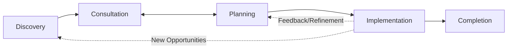
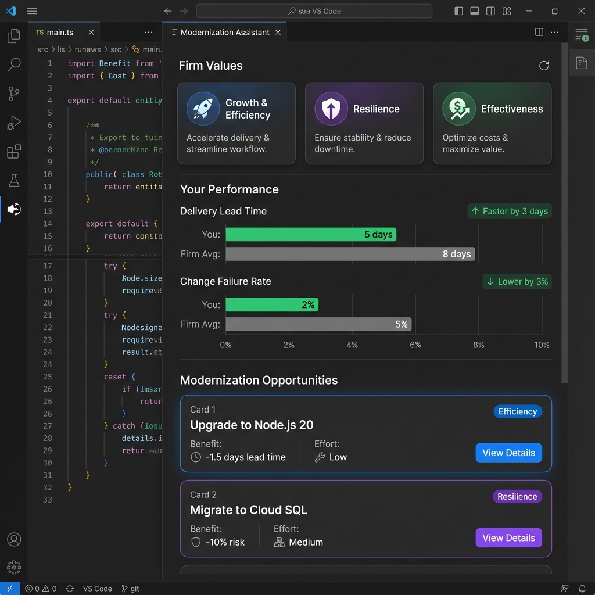
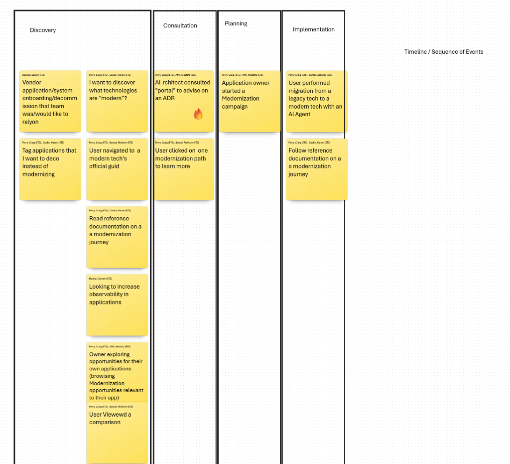
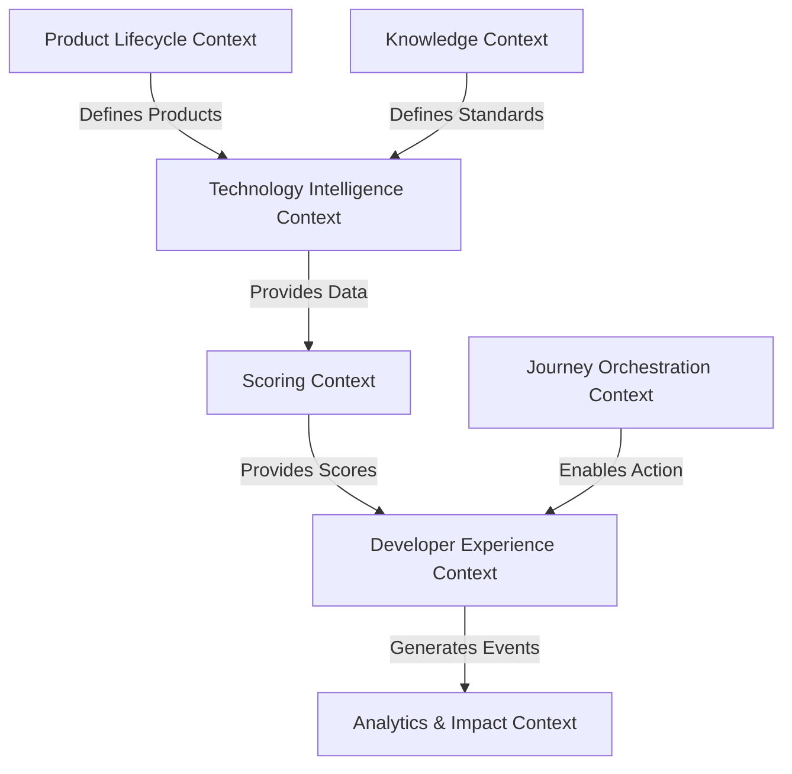

# Ubiquitous Language (Developer-Facing)

This document defines the canonical vocabulary used across the TechMod modernization platform from the perspective of a developer who owns and maintains an application. It spans strategic, tactical, and operational layers and aligns with the platform's bounded contexts.

---

## 1. Strategic Vocabulary

### Application

An internally developed application with a TFS score. (Defined as internally developed software in production with an EONID.) Our primary Modernization unit.

### EONID

A firm‑internal unique identifier assigned to every application. Used as the authoritative key for tracking modernization state, scores, and lifecycle changes.

### Modernization

The continuous improvement of an application's technology, architecture, and practices to advance one of Technology's value drivers.

### Value Driver

The strategic reasons for modernization:

- **Growth & Efficiency**
- **Resilience**
- **Effectiveness**

### Outcome Metric

A measurable indicator of application performance (e.g., Lead Time, Change Failure Rate, MTTR, Incident Volume).

### Application Current State

The authoritative snapshot of an application's technologies, configurations, dependencies, architecture traits, and practice indicators at a point in time. Used by the AI Advisor, Scoring Engine, and Journey Orchestration to determine suitability, prerequisites, and recommended Journeys.

### Modernity Life Cycle

A framework defining technology states:

- **Assess**: A technology under consideration
- **Adopt**: A technology in active use and supported
- **Continue**: A technology in widespread use and stable
- **Hold**: A technology with emerging risks. New usage discouraged.
- **Migrate**: A technology with known risks. Usage should be replaced.

### Modernization Score (Technical Fitness Score / TFS)

A composite score representing an application's overall modernization level from 0 - 100, calculated from multiple components. Often referred to as **Technical Fitness Score (TFS)** in executive reporting.

### Goldilocks Opportunity

A modernization opportunity that is **measurable**, **manageable**, and has **clear value** (Stage 4 readiness). These are the primary focus for scaled execution.

### Opportunity Family of Terms

- **Modernization Opportunity** – the improvement itself.
- **Goldilocks Opportunity** – the subset that is measurable, manageable, and high‑value.
- **Opportunity Card** – the UI representation of an Opportunity.
- **Opportunity Explorer** – the interface for browsing Opportunities.

### Modernization Opportunity

A specific improvement that advances modernization (e.g., "Upgrade to Node.js 20").

### Opportunity–Journey–Campaign Relationship

A **Modernization Opportunity** defines _what_ should be modernized – a specific technology, architecture, or practice that advances a value driver and delivers measurable benefit (e.g., "Upgrade to latest web hosting technology to reduce lead time by 2 days").
A **Modernization Journey** defines _how_ to implement that Opportunity through recipes, documentation, and AI‑assisted steps.
A **Modernization Campaign** is a coordinated marketing and enablement effort that promotes one or more Opportunities across the firm.

### Product

The authoritative definition of a technology product (e.g., "PostgreSQL", "Spring Boot") within the **TBM Taxonomy**. It serves as the anchor for modernity decisions.

### Product Decision Record (PDR)

The immutable record of a modernity decision for a **Product**. It captures the "Why", "Business Case", "Options Evaluated", and "Implications" of a technology's classification (e.g., why "Java 8" is "Migrate").

### Technology Profile

A structured representation of the technologies an application uses, including versions, configurations, lifecycle status, and modernity classification. Produced by the Technology Intelligence Context and consumed by Scoring, Developer Experience, and Journey Orchestration.

### Modernization Journey

A guided implementation path that delivers a Modernization Opportunity. It includes automated recipes, required documentation, validation steps, and AI‑assisted migration actions. A Journey represents the end‑to‑end execution needed to adopt a modern technology, practice, or architecture.

---

## 2. Tactical Vocabulary

This vocabulary reflects the actual developer journey observed in the modernization workflow: **Discover → Consult → Plan → Implement**.

### 2.1 Discovery Vocabulary

These terms describe how developers explore modernization options, documentation, and technologies.

### Modern Technology Catalog

A browsable catalog of technologies classified by modernity lifecycle (Assess, Adopt, Continue, Hold, Migrate), organized by the **TBM Taxonomy** (Technology Delivery & Workplace).

### Technology Comparison

A side‑by‑side view that helps developers compare modern technologies or evaluate alternatives.

### Modernization Knowledge Base

The collection of reference documentation, official guides, patterns, and modernization journey descriptions.

### Application Tagging

The act of tagging an application as "modernize", "replatform", "refactor", or "decommission" during early exploration.

### Opportunity Explorer

A tool where developers browse modernization opportunities relevant to their application.

---

### 2.2 Consultation Vocabulary

These terms describe AI-assisted architecture guidance, consultation, and deeper investigation into modernization paths.

### AI Architecture Advisor

An AI-assisted architecture companion that guides developers on modernization decisions, ADRs, or recommended patterns.

### Modernization Path Overview

A high-level description of what a modernization journey entails, including benefits, prerequisites, and major steps.

### Guided Recommendation Session

A consultation process where the AI Advisor dynamically reviews the application's state and proposes suitable modernization directions.

---

### 2.3 Planning Vocabulary

These terms describe the developer’s commitment to a modernization effort and alignment of scope.

### Modernization Campaign

An orchestrated marketing and awareness initiative designed to increase adoption of a Modernization Opportunity. A Campaign coordinates communications, education sessions, guidance, and targeted messaging to help developers understand _why_ an Opportunity matters and _how_ to adopt it.

### Campaign–Journey Relationship

A Campaign promotes Opportunities; Journeys implement them. A Campaign may promote one or more Opportunities, each of which is executed through its corresponding Journey.

### Campaign Scope

The set of opportunities and technologies selected for modernization within a campaign.

### Campaign Plan

The structured, ordered sequence of modernization steps—automated or manual—that the developer intends to follow.

---

### 2.4 Implementation Vocabulary

These terms describe hands-on modernization work carried out by developers or AI agents.

### AI-Assisted Migration Step

An automated or semi-automated transformation executed by an AI agent to move from a legacy technology to a modern one.

### Reference-Driven Implementation

A modernization step performed by the developer manually by following official guidance or documentation.

### Execution Session

A unit of implementation work, automated or manual, that advances the modernization campaign.

## 3. Operational Vocabulary

### Journey Execution

The act of performing a modernization journey, often involving automation and developer validation.

### State Checkpoint

A recorded point in a journey capturing progress and decisions.

### Automated Change

A code or configuration modification produced by a recipe.

### Pull Request (PR) Proposal

A PR generated by the system as a result of a recipe or journey step.

### Diagnostic Run

A system-triggered evaluation to verify readiness for modernization.

### Validation Step

A point where developer approval is required before continuing.

### Rollback Point

A stored state the system can revert to if needed.

### Success Criteria

The measurable conditions for successful completion of a journey.

### Completion

The point where a journey reaches its target state and the application’s modernization score updates.

### Telemetry Event

A recorded event capturing modernization actions.

---

## 4. Domain Events

Events identified during the Event Storming session, categorized by phase:

### Discovery

- **Technology Catalog Browsed**
- **Application Tagged for Decommission**
- **Official Guide Viewed**
- **Journey Documentation Viewed**
- **Modernization Opportunities Browsed**
- **Technology Comparison Viewed**

### Consultation

- **ADR Advice Requested**
- **Modernization Path Details Viewed**

### Planning

- **Modernization Campaign Started**

### Implementation

- **AI Migration Step Executed**
- **Manual Migration Step Completed**

---

## 5. Aggregates, Entities, and Value Objects

### Aggregates

- Application
- Journey
- Scorecard
- Opportunity
- Technology Profile
- Modernization PR
- Product
- Product Decision Record (PDR)

### Entities

- Dependency
- Technology
- Practice Indicator
- Architecture Pattern
- Recipe Execution

### Value Objects

- Version
- Effort Estimate
- Benefit Estimate
- Risk Rating
- Score Component
- Metric Delta

---

## 6. Bounded Context Vocabulary Anchors

The following diagram illustrates the relationships and data flow between the bounded contexts:

### Scoring Context

Score, Scorecard, Metric, Component, Posture, Delta.

### Technology Intelligence Context

Technology, Version, Modernity, Detection, EOL, Technology Profile.

### Knowledge & Governance Context

Standard, Pattern, Recommendation, Localization, Exception.

### Product Lifecycle Context

Product, Product Catalog, PDR, Modernity Governance, TBM Taxonomy.

### Journey Orchestration Context

Journey, Step, Recipe, Execution, Checkpoint, Validation, PR.

### Developer Experience Context

Dashboard, Opportunity Card, Recommendation, Progress, Panel.

### Analytics & Impact Context

Outcome Metric, Trend, ROI, Usage Event, Success Story.
